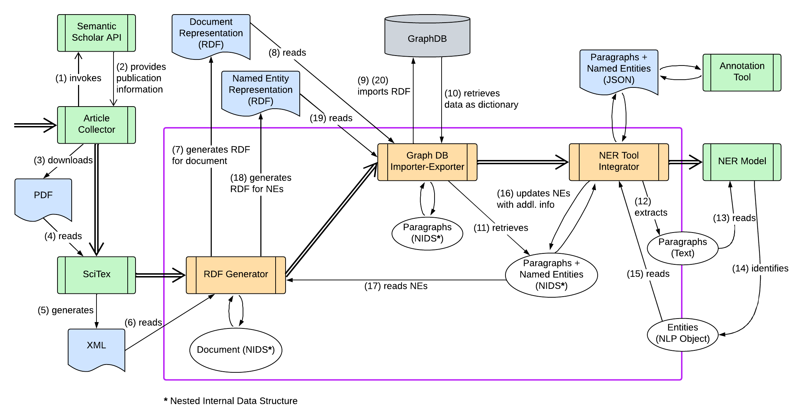

# CelloGraph Working Pipeline

### System Description:

The system starts by retrieving open-access publications related to cellulosic materials. This task is handled by the Article Collection module, which uses the Semantic Scholar API to obtain both the metadata and the URLs of the publications. The module then accesses these URLs, downloads the corresponding PDFs, and stores them in a designated location. Next, the SciTex module processes the downloaded PDFs and converts them into XML format. These XML files are then passed to the RDF Generator, which reads the content and generates RDF representations of each document using an internal data structure. The RDF files are subsequently imported into a graph database by the Graph DB Import-Export module. This same module is also responsible for retrieving individual paragraphs from the graph database and passing them to the NER Tool Integrator module. This module restructures the retrieved data into JSON format suitable for use in the annotation tool.\
In parallel, the NER Tool Integrator module extracts paragraphs and sends them to the NER module for named entity recognition. The NER module identifies relevant entities and returns the results. The JSON module then organizes the recognized entities along with other relevant information and sends this structured data back to the RDF Generator, which produces RDF representations of the extracted terms. Finally, the Graph DB Import-Export module imports these RDF representations into the graph database, completing the cycle of data processing.
